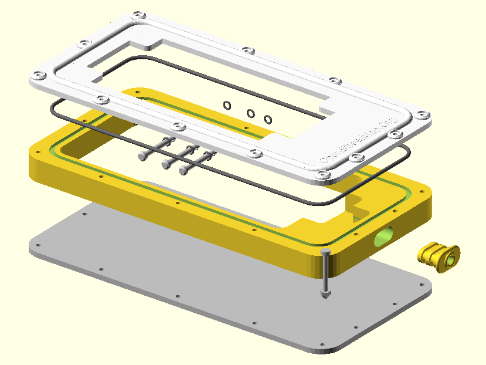

# Do It Yourself, 3D-Print, IP64 Waterproof Case for generic Smartphone

An OpenSCAD model of a smartphone case, suitable for motorbike mounting and GPS navigation.

* Main body and front frame made with 3d-printed nylon; allow GPS signal reception.
* Aluminium back panel (laser cut) and silicone padding for heat dissipation; should operate under summer direct sunlight.
* The screen is protected by a PETG sheet (laser cut).
* At least IP64 protection: dust proof and water splashing from any directions.
* Customizable for any smartphone, just input the measures and 3D-print it!
* Passthrough hole for power cable.
* Operating smartphone side buttons.

**NOTICE**: This project is still in beta stage, the object was not actually build yet.

## The OpenSCAD model

### Parametric Project

You should set at least the size of your device (smartphone) and the position of
the side buttons (at the moment only le right side is coded). Browse the
**ip64-smartphone-case.scad** and search for **phone_x**, **phone_y**, **phone_z**
variables. Buttons coordinates are into **btn_right_pos_y** array.

### Exploded View

Open the **proj-assembling-test.scad** file and see the preview. To see an exploded
view, set the **exploded** variable to a value greather than zero (it is millimters,
try with 20).

### 2D print test

Open the **proj-2d-test.scad** project file, render it and export in DXF format.
It is a 2D drawing that you can print on paper, so you can check the overall
dimensions and actual smartphone fitting.

## 3D Printed parts

For 3D printing you must render two objects:

* Main body.
* Front frame.

Before starting the final rendering, set proper values for the variables **rounded_fn**
and **smalld_fn**. They control the **$fn** OpenSCAD special variable, i.e. the number
of fragments to render a full circle. The first variable is for rounded objects, the
second is for small diamters pin and holes. You should try __rounded_fn=92__ and
__smalld_fn=64__ at least.

## Laser cut parts

* Aluminium back panel.
* PETG screen cover sheet.

## Miscellaneus parts to be purchased separately

* Clevis pins to operate the smartphone side buttons.
* O-Rings for clevis pins.
* O-Rings for power cable grommet.
* O-Ring cord for main body seal.
* Nuts and bolts for main body assembly.
* Thermally conductive silicone rubber.
